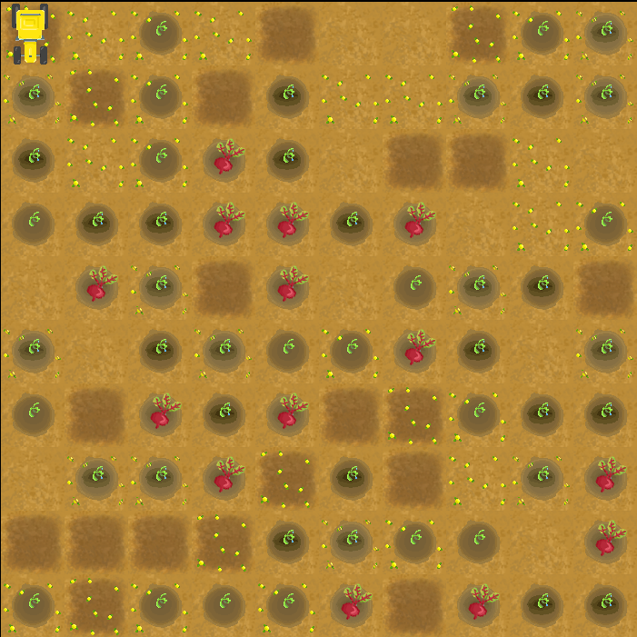

# Sztuczna Inteligencja - Raport 1

**Członkowie zespołu:** Marcin Kwapisz, Kamila Matysiak, Piotr Rychlicki, Justyna Zarzycka

**Temat projektu:** Inteligentny Traktor


## Środowisko agenta i reprezentacja wiedzy

Projekt został napisany w języku **python**, z użyciem modułów **numpy** oraz **pygame**. 


### Plansza

Po uruchomieniu programu Numpy generuje kwadratową macierz o 10 wierszach, która jest liczbową reprezentacją naszej planszy(można też umieścić przygotowaną wcześniej macierz zamiast generować ją losowo, jednak trzeba to wykonać na poziomie kodu).

Do każdego pola przypisana jest losowa wartość od 0 do 8, które oznaczają:
* 0 - pole czyste
* 1 - chwasty
* 2 - sadzonki
* 4 - nawodnienie
* 8 - gotowe do zbiorów




### Agent 

Agent posiada wiedzę o swojej pozycji na planszy oraz stanie poszczególnych pól.

Sterowanie agentem:

* klawisze W, A, S, D - poruszanie się po planszy
* klawisze 1, 2, 3, 4 - przełączanie trybu 
* spacja - wykonanie czynności 

Informacje o liczbie przebytych kroków przez traktor, oraz trybie w jakim obecnie pracuje widoczne są w oknie aplikacji pod planszą. 


### Struktura plików projektu 

* images - grafika aplikacji
* raports - raporty
* config - plik zawierający podstawowe ustwienia i klasy
* main.py - plik rozruchowy programu
* functions.py - plik odpowiedzialny za funkcje 


### Uruchomienie aplikacji

```bash
pip3 install pygame numpy #instalacja modułów
python3 main.py #uruchomienie 
```

[film dokumentujący uruchomienie aplikacji](https://uam-my.sharepoint.com/personal/pioryc_st_amu_edu_pl/_layouts/15/onedrive.aspx?id=%2Fpersonal%2Fpioryc%5Fst%5Famu%5Fedu%5Fpl%2FDocuments%2FSI%20Projekt%20Traktor%2FUruchomienie%5Fagenta%5F07%2E04%2E2020%2Emp4&parent=%2Fpersonal%2Fpioryc%5Fst%5Famu%5Fedu%5Fpl%2FDocuments%2FSI%20Projekt%20Traktor&originalPath=aHR0cHM6Ly91YW0tbXkuc2hhcmVwb2ludC5jb20vOnY6L2cvcGVyc29uYWwvcGlvcnljX3N0X2FtdV9lZHVfcGwvRVZMejk0Z2RCajVLdUp0WjFYZWk2SEFCdm1Dd3UwVzRGbEdlVC1IazNWbFdsdz9ydGltZT02Q0pBc09iYTEwZw)
